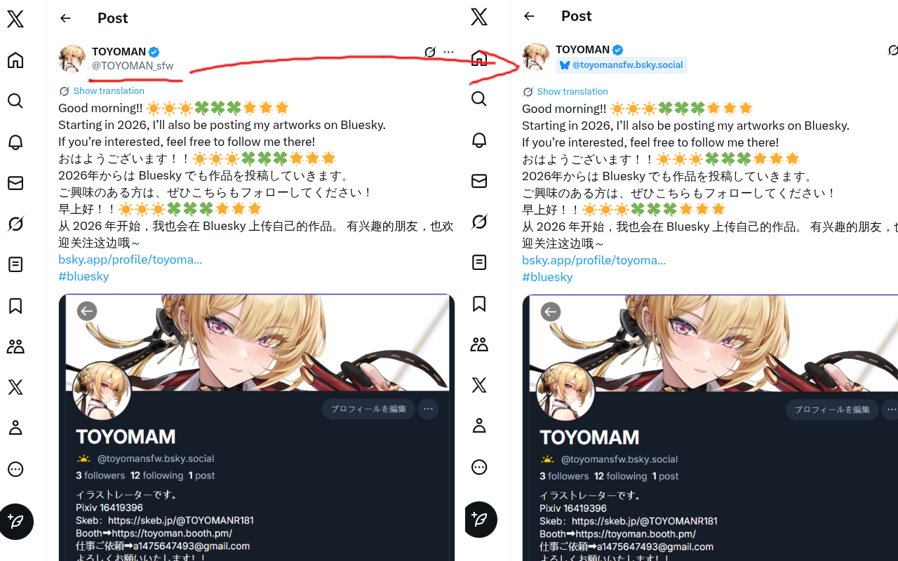
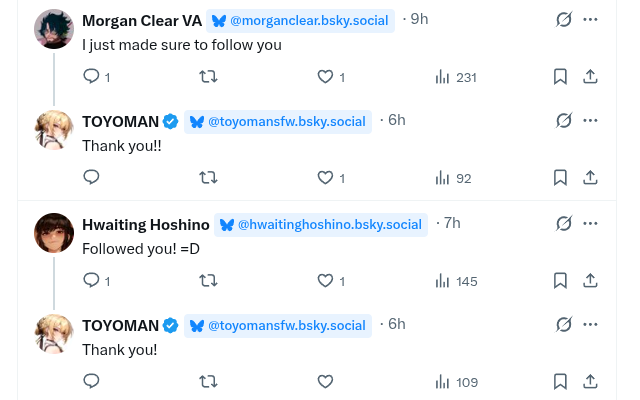

# Xscape Hatch

A Chrome extension that helps you find people on Bluesky. When browsing X/Twitter, it detects Bluesky handles and adds clickable badges so you can follow them with one click.

Why? X shadowbans posts containing Bluesky links, so users share their handles in screenshots instead. Xscape Hatch uses OCR to read those screenshots and find the handles for you.

## Features

- Detects Bluesky handles mentioned in tweet text
- Uses OCR to find handles in profile screenshot images
- Adds clickable badges linking directly to Bluesky profiles
- Works on user profile pages
- Smart caching for instant display on repeat visits

## Screenshots


*Detects Bluesky handles from profile screenshots using OCR*


*Adds clickable Bluesky badges next to usernames*

## Installation

### Chrome Web Store

Coming soon. For now, use manual installation below.

### Manual Installation

1. Clone this repository
   ```bash
   git clone https://github.com/your-username/xscape-hatch.git
   cd xscape-hatch
   ```

2. Install dependencies and build
   ```bash
   npm install
   npm run build
   ```

3. Load in Chrome
   - Open `chrome://extensions`
   - Enable "Developer mode" (toggle in top right)
   - Click "Load unpacked"
   - Select the `dist/` folder

## How It Works

When you browse X, Xscape Hatch scans tweets for Bluesky handles. It can read handles from profile screenshot images using OCR. When it finds a valid handle, it adds a clickable butterfly badge next to the username so you can visit their Bluesky profile with one click.

---

## For Developers

### Quick Start

```bash
npm install
npm run build
npm run watch    # development mode with auto-rebuild
npm test
npm run lint
npm run typecheck
```

### Architecture Overview

The extension uses Chrome's Manifest V3 architecture:

- **Content script** runs on x.com, watches for tweets, extracts handles, injects badges
- **Service worker** handles API calls to verify Bluesky profiles exist
- **Offscreen document** hosts Tesseract.js for OCR (MV3 doesn't allow workers in service workers)

Three cache layers minimize API calls and re-processing: API results (24h), OCR results (7d), and Twitter→Bluesky mappings (permanent).

### Project Structure

```
src/
├── background/   # Service worker - API calls, message routing
├── content/      # Content script - DOM observation, badge injection
├── offscreen/    # OCR processing with Tesseract.js
├── shared/       # Caching, messaging, constants
└── types/        # TypeScript interfaces
```

### More Details

See [CLAUDE.md](./CLAUDE.md) for comprehensive technical documentation including architecture details, caching system, message flow, and testing guide.

## License

GPL - see [LICENSE](./LICENSE)
